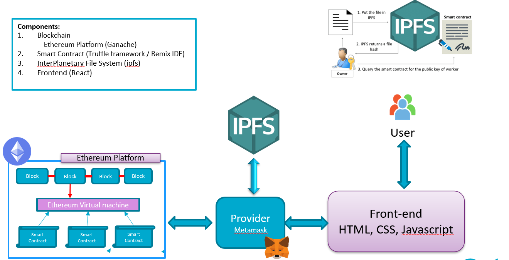
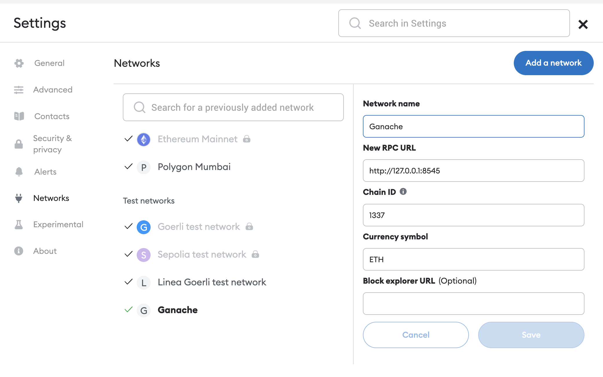
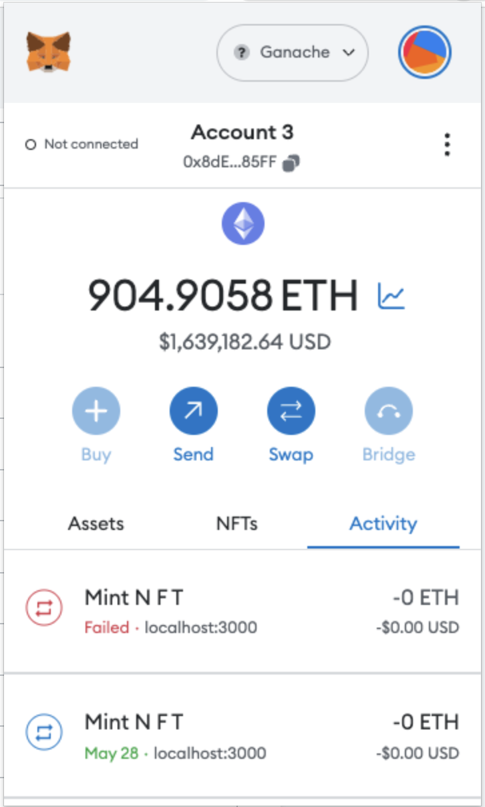
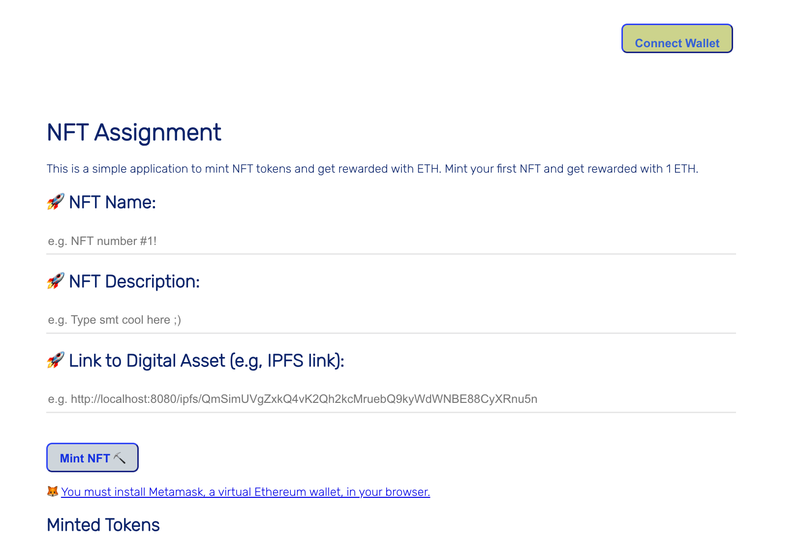
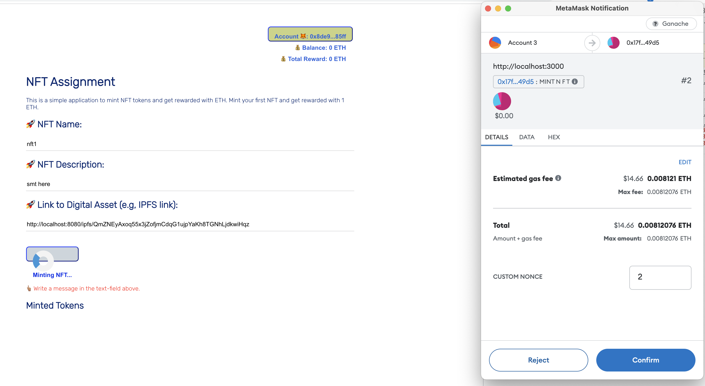
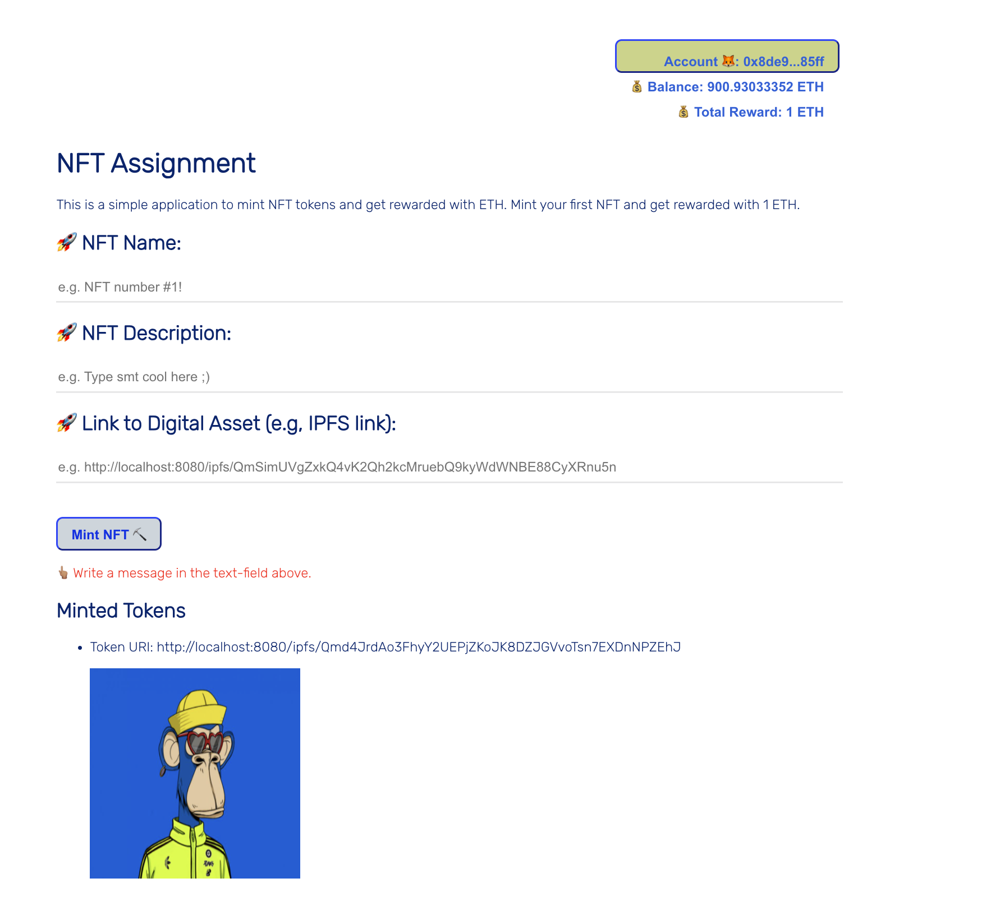

# Tutorial: NFT-minting-tutorial
## Feel free to create issues and PR for the completed solution. 
A tutorial for designing full-stack Non-Fungible Token (NFT) minting application.

## Prerequisites
- Node.js ^v16.20.0
- Metamask
- Ganache UI or ganache-cli
- Truffle@latest framework
- InterPlanetary File System / IPFS
- React.js
- Solidity
- OpenZeppelin
- Chai Assertion Library

## Overview
This tutorial will walk you through the process of designing a full-stack Non-Fungible Token (NFT) minting application. The application will allow users to mint NFTs, view their NFTs, and transfer their NFTs to other users. The application will be built using React.js, Solidity, and OpenZeppelin. The application will also use the Chai Assertion Library for testing. The application will be deployed to the Local Ethreum / Rinkeby test network.



## Table of Contents
- [Prerequisites](#prerequisites)
- [Overview](#overview)
- [Step-by-Step Guide](#step-by-step-guide)
- [Create your first Ethereum Blockchain using Ganache UI or ganache-cli](#create-your-first-ethereum-blockchain-using-ganache-ui-or-ganache-cli)
- [Connect Metamask to your local Ethereum Blockchain](#connect-metamask-to-your-local-ethereum-blockchain)
- [Setup IPFS Storage](#setup-ipfs-storage)
- [Deploy Smart Contract to Local Ethereum Blockchain](#deploy-smart-contract-to-local-ethereum-blockchain)
- [Deploy Smart Contract to Rinkeby Test Network](#deploy-smart-contract-to-rinkeby-test-network)
- [Client-side](#client-side)

## Step-by-Step Guide

- Clone the repo to your local machine
```bash
git clone https://github.com/lamnd09/nft-minting-tutorial.git
cd nft-minting-tutorial
```
- cd into the client directory
```bash
cd client
npm install 
npm start 
```
- to the root repository, install dependencies
```bash
npm install 
npm install @openzeppelin/contracts
```


### Create your first Ethereum Blockchain using Ganache UI or ganache-cli
- Download and install Ganache UI or ganache-cli from https://www.trufflesuite.com/ganache
 or just run 
```bash
npm install -g ganache 
```
To check full options of ganache-cli, run 
```bash
ganache-cli --help
```

next, in order to create a local Ethereum Blockchain, run 
```bash
ganache-cli -a 20 -e 1000  -m "test test test test test test test test test test test okay" -i 1337
```
You should see the output as below: 

```bash
Ganache CLI v6.12.2 (ganache-core: 2.13.2)
Available Accounts
==================
(0) 0x8dE930dbAd0D99759Db57C2F906010f87D4185FF (1000 ETH)
(1) 0x9032969C6ac84f644bA65E40089ce221053ad624 (1000 ETH)
(2) 0xA1e77EC2f0ad59121DA812cd5be61E3CAc30F472 (1000 ETH)
(3) 0x363404432Aa9d4EF5629f80DAcFF0CD389dd38c8 (1000 ETH)
(4) 0x5c22Fd2D3E9eB70EF3585E0F895eE4d076d04414 (1000 ETH)
(5) 0xF221a97B436f16b8a2916eA232f45D5f5C5DAD10 (1000 ETH)


Private Keys
==================
(0) 0xaefcaad212aba1ac9c96f94f5dcef495467fb745179976fbe31711bc559fedcf
(1) 0xb2152533065ded1085494e704786c14e4258097fba26273adf5f44645fca17d2
(2) 0xceb1d8bc2c141e448d3d31fb5671a1b03a552a8d5ec683ad9513aa8289b84a8b
(3) 0x8ab686ec316e15671f09cceaf463d8d2bca58d87852f7f245aef86a787834abc
(4) 0x5263a193a48c089e9320320bac29b0fbd89c3e1abc5e8c3bc938b87dd4e4de15
(5) 0xc1a2ac12f6560e32fcac5ab7631bd6282c20e2b37abd307ed29ab033db3b1584

HD Wallet
==================
Mnemonic:      test test test test test test test test test test test okay
Base HD Path:  m/44'/60'/0'/0/{account_index}

Gas Price
==================
20000000000

Gas Limit
==================
6721975

Call Gas Limit
==================
9007199254740991

Listening on 127.0.0.1:8545
```

### Connect Metamask to your local Ethereum Blockchain
- Install Metamask in your web browser
- Connect Metamask to your local Ethereum Blockchain

- Import the private keys of the accounts generated by Ganache UI or ganache-cli
After import, you should see the account information. 


### Setup IPFS Storage

- Install IPFS on your local machine 
Link to download IPFS  https://docs.ipfs.tech/install/command-line/#install-official-binary-distributions

For Ubuntu OS, just run : 
```bash
wget https://dist.ipfs.tech/kubo/v0.20.0/kubo_v0.20.0_linux-amd64.tar.gz
tar -xvzf kubo_v0.20.0_linux-amd64.tar.gz
cd kubo
sudo bash install.sh
ipfs --version
```
You can find the detail instructions for your OS in the link above. 

- Start IPFS daemon
```bash
ipfs init
ipfs config --json API.HTTPHeaders.Access-Control-Allow-Origin '["http://localhost:3000"]'
ipfs config --json API.HTTPHeaders.Access-Control-Allow-Methods '["PUT", "POST", "GET"]'
ipfs daemon
```

- Add your file to IPFS 
```bash
ipfs add <your file>
```
example, 
```bash
ipfs add ./gallery/nft1.jpg

added QmZNEyAxoq55x3jZofjmCdqG1ujpYaKh8TGNhLjdkwiHqz nft1.jpeg
 31.87 KiB / 31.87 KiB [================================================] 100.00%>

ipfs add ./gallery/nft2.jpg

added QmRuJJT9cqVJvxMukG56WtEBbgbTQrknpWXyHTvDN41guf nft2.jpg
 50.52 KiB / 50.52 KiB [================================================] 100.00%

ipfs add ./gallery/nft3.jpg

added QmS7XWuQd8pNPGMEpkTkhft3k5gCCc7TUZzVXQpXcSGj8B nft3.jpg
 176.41 KiB / 176.41 KiB [==============================================] 100.00%
```

- Get the hash of your file
```bash
ipfs cat <hash of your file>
```

### Compile and Deploy the Smart Contract to your local Ethereum Blockchain

- Design the Smart Contract


```solidity
// SPDX-License-Identifier: MIT
pragma solidity ^0.8.17;

import "@openzeppelin/contracts/token/ERC721/extensions/ERC721URIStorage.sol";
import "@openzeppelin/contracts/utils/Counters.sol";
import "@openzeppelin/contracts/access/Ownable.sol";

contract MyNFT is ERC721URIStorage, Ownable {
    using Counters for Counters.Counter;
    Counters.Counter private _tokenIds;

    // Mapping to track the rewards received by each user
    mapping(address => uint256) private rewardsReceived;
    // Mapping to track the NFTs minted by each user
    mapping(address => uint256[]) private userMintedTokens;
    // Mapping to check if a token has already been minted
    mapping(string => bool) private tokenExists;

    constructor() public ERC721("MyNFT", "NFT") {}

    function mintNFT(address recipient, string memory tokenURI)
        public
        returns (uint256)
    {
        require(!tokenExists[tokenURI], "Token already exists");

        _tokenIds.increment();

        uint256 newItemId = _tokenIds.current();
        _mint(recipient, newItemId);
        _setTokenURI(newItemId, tokenURI);

        // Reward the user with 1 ETH.
        rewardUser(recipient);

        // Track the NFTs minted by the user
        userMintedTokens[recipient].push(newItemId);

        // Mark the token as minted
        tokenExists[tokenURI] = true;

        return newItemId;
    }

    function rewardUser(address user) internal {
        uint256 rewardAmount = 1 ether;

        require(address(this).balance >= rewardAmount, "Not enough Ether to reward user");

        // Update the rewardsReceived mapping
        rewardsReceived[user] += rewardAmount;

        // Transfer the reward to the user.
        (bool success, ) = payable(user).call{value: rewardAmount}("");
        require(success, "Failed to send Ether");

        emit UserRewarded(user, rewardAmount);
    }

    // This function allows the contract owner to deposit ETH into the contract
    function depositETH() public payable {}

    // This function will allow the owner to withdraw all the remaining ETH.
    function withdrawETH() public onlyOwner {
        uint balance = address(this).balance;
        payable(owner()).transfer(balance);
    }

    // Function to get the total amount of rewards an user received
    function totalRewards(address user) public view returns (uint256) {
        return rewardsReceived[user];
    }

    // Function to get all tokens minted by a user
    function getMintedTokens(address user) public view returns (uint256[] memory) {
        return userMintedTokens[user];
    }

    // Function to check if a token with a given URI already exists
    function checkTokenExists(string memory tokenURI) public view returns (bool) {
        return tokenExists[tokenURI];
    }

    // Event emitted when a user is rewarded
    event UserRewarded(address indexed user, uint256 rewardAmount);
}
```
Let me explain line-by-line of the code 
Certainly, let's go line by line:

1. `pragma solidity ^0.8.17;`: This line tells that the source code is written in Solidity language version 0.8.17.

2. The next three lines import external smart contracts from the OpenZeppelin library, which is a framework of reusable and secure smart contracts in the Solidity language.

   - `import "@openzeppelin/contracts/token/ERC721/extensions/ERC721URIStorage.sol";` imports a standard implementation of an ERC721 token with URI storage.
   
   - `import "@openzeppelin/contracts/utils/Counters.sol";` imports a utility library for safe counter arithmetic.
   
   - `import "@openzeppelin/contracts/access/Ownable.sol";` imports a contract that provides basic authorization control functions. This simplifies the implementation of "user permissions".

3. `contract MyNFT is ERC721URIStorage, Ownable {`: This line declares the smart contract named "MyNFT", which inherits from the ERC721URIStorage and Ownable contracts.

4. `using Counters for Counters.Counter;`: This line attaches the Counters library functions to the Counters.Counter struct.

5. `Counters.Counter private _tokenIds;`: Here, _tokenIds is a state variable of type Counter that will keep track of the total number of tokens minted by the contract.

6. `mapping(address => uint256) private rewardsReceived;`: This line declares a state variable `rewardsReceived`, which is a mapping from addresses to integers. It will keep track of the total rewards received by each address.

7. `mapping(address => uint256[]) private userMintedTokens;`: This line declares a state variable `userMintedTokens`, which is a mapping from addresses to arrays of integers. It will keep track of all the tokens minted by each address.

8. `mapping(string => bool) private tokenExists;`: This line declares a state variable `tokenExists`, which is a mapping from strings to booleans. It will help prevent the minting of the same token URI more than once.

9. `constructor() public ERC721("MyNFT", "NFT") {}`: This is the constructor of the contract which is called when the contract is deployed. It calls the constructor of the ERC721 token with a name and a symbol.

10. `mintNFT` is a public function that allows users to mint a new NFT. The function first checks if the tokenURI already exists, increments the tokenIds counter, mints the new token, sets its URI, rewards the user, and keeps track of the newly minted token.

11. `rewardUser` is an internal function that rewards a user with 1 Ether after minting an NFT. It first checks if the contract has enough balance to reward, then sends the Ether and emits a `UserRewarded` event.

12. `depositETH` is a public payable function that allows the owner to deposit Ether into the contract.

13. `withdrawETH` is a public function that allows the owner to withdraw all the Ether from the contract.

14. `totalRewards` is a view function that returns the total rewards received by a user.

15. `getMintedTokens` is a view function that returns all tokens minted by a user.

16. `checkTokenExists` is a view function that checks if a token with a given URI already exists.

17. `event UserRewarded` is an event that gets emitted whenever a user is rewarded. 


- Compile the smart contract
```bash
truffle compile
```
The output looks like 
```bash
Compiling your contracts...
===========================
> Compiling ./contracts/MyNFT.sol
> Compiling @openzeppelin/contracts/access/Ownable.sol
> Compiling @openzeppelin/contracts/token/ERC721/ERC721.sol
> Compiling @openzeppelin/contracts/token/ERC721/IERC721.sol
> Compiling @openzeppelin/contracts/token/ERC721/IERC721Receiver.sol
> Compiling @openzeppelin/contracts/token/ERC721/extensions/ERC721URIStorage.sol
> Compiling @openzeppelin/contracts/token/ERC721/extensions/IERC721Metadata.sol
> Compiling @openzeppelin/contracts/utils/Address.sol
> Compiling @openzeppelin/contracts/utils/Context.sol
> Compiling @openzeppelin/contracts/utils/Counters.sol
> Compiling @openzeppelin/contracts/utils/Strings.sol
> Compiling @openzeppelin/contracts/utils/introspection/ERC165.sol
> Compiling @openzeppelin/contracts/utils/introspection/IERC165.sol
> Compiling @openzeppelin/contracts/utils/math/Math.sol
> Artifacts written to /home/ngu202/workspace/nft-minting-tutorial/build/contracts
> Compiled successfully using:
   - solc: 0.8.19+commit.7dd6d404.Emscripten.clang
```
If there is any error, you should fix it before going to the next step..

- Deploy the smart contract to your local Ethereum Blockchain
```bash
truffle migrate
```
The output looks like 
```bash
Compiling your contracts...
===========================
> Everything is up to date, there is nothing to compile.


Starting migrations...
======================
> Network name:    'development'
> Network id:      1337
> Block gas limit: 6721975 (0x6691b7)


1_mynft_migration.js
====================

   Replacing 'MyNFT'
   -----------------
   > transaction hash:    0x034ae890073b5e61e50a3fa50e30f9505bf363cef503689980e985be143241a0
   > Blocks: 0            Seconds: 0
   > contract address:    0x17f713aC25039abbfFc34354d3084FC2183b49d5
   > block number:        1
   > block timestamp:     1685989845
   > account:             0x8dE930dbAd0D99759Db57C2F906010f87D4185FF
   > balance:             999.93683094
   > gas used:            3158453 (0x3031b5)
   > gas price:           20 gwei
   > value sent:          0 ETH
   > total cost:          0.06316906 ETH

   > Saving artifacts
   -------------------------------------
   > Total cost:          0.06316906 ETH

Summary
=======
> Total deployments:   1
> Final cost:          0.06316906 ETH
```

Meanwhile, if you check in the ganache-cli console, there will  be a transaction crated as : 
```bash
  Transaction: 0x804493fea685ba2270aa45f372150488edc7d1d349c37e8cf25d03156ca20b4d
  Contract created: 0x80d09df430fd965e644ddb8925374f49a73d44e5
  Gas usage: 3191316
  Block Number: 12
  Block Time: Mon Jun 05 2023 18:43:32 GMT+0000 (Coordinated Universal Time)
```

In which: 
- Replacing 'MyNFT': This line indicates that the 'MyNFT' contract is being deployed. If a contract of the same name was already deployed, it's being replaced with this new one.
- Transaction hash: This is the unique identifier of the transaction that was generated when the contract was deployed. 
- The smart contract is deployed to the address `0x17f713aC25039abbfFc34354d3084FC2183b49d5`
- The account `0x8dE930dbAd0D99759Db57C2F906010f87D4185FF` is the owner of the smart contract.  This an important value that you would use to interact with your contract.
- Block number: This is the number of the block in which the contract deployment transaction was included.
- Block timestamp: The timestamp of when the block was mined.
- Account: The address of the account that deployed the contract.
- Balance: The balance of the account that deployed the contract, after the contract was deployed.
- Gas used: This is the total amount of "gas" that was used in the process. In Ethereum, "gas" refers to the computational work required to do a transaction or smart contract operation.
- Gas price: The price you're paying for each unit of gas, in gwei. The total transaction cost is gas used times gas price.
- Value sent: The value sent along with the transaction, in this case, is 0 ETH.
- Total cost: The total cost of the transaction, in ETH.
- Saving artifacts: Artifacts are a way of storing contract abstractions for easy use later. An artifact includes important information about the contract like the contract's deployed address and Application Binary Interface (ABI). The ABI is like a list of methods and variables that you can call on your contract.
- Total deployments: The total number of contract deployments executed in this migration.
- Final cost: The total cost of all contract deployments in this migration.

### test the smart contract
```bash
truffle test
```
The output looks like 
```bash
Using network 'development'.


Compiling your contracts...
===========================
> Everything is up to date, there is nothing to compile.


  Contract: MyNFT
    ✔ should mint a new NFT (222ms)
    ✔ should fail when minting a token with a URI that already exists (632ms)
    ✔ should deposit ETH (60ms)
    ✔ should withdraw all ETH (117ms)


  4 passing (2s)
```

### Deposit ETH to the smart contract
```bash
node src/utils/depositEthereum.js
```
The output looks like 
```bash
  transactionHash: '0xd0523aed266b475b891162382d57ffb564ebcbd32bebd972bbbc0305a8f71dc5',
  transactionIndex: 0,
  blockHash: '0xefbb664f81346beea248de83d464b242f4768bdfc3fcc42a978f84899531845c',
  blockNumber: 2,
  from: '0x8de930dbad0d99759db57c2f906010f87d4185ff',
  to: '0x17f713ac25039abbffc34354d3084fc2183b49d5',
  gasUsed: 21316,
  cumulativeGasUsed: 21316,
  contractAddress: null,
  status: true,
  logsBloom: '0x00000000000000000000000000000000000000000000000000000000000000000000000000000000000000000000000000000000000000000000000000000000000000000000000000000000000000000000000000000000000000000000000000000000000000000000000000000000000000000000000000000000000000000000000000000000000000000000000000000000000000000000000000000000000000000000000000000000000000000000000000000000000000000000000000000000000000000000000000000000000000000000000000000000000000000000000000000000000000000000000000000000000000000000000000000000',
  events: {}
}
```

## Client side

### Install dependencies
```bash 
cd client
npm install
npm start
```
You can see the dashboard as below: 



http://localhost:8080/ipfs/QmZNEyAxoq55x3jZofjmCdqG1ujpYaKh8TGNhLjdkwiHqz

Set your inputs as below:


Click on the `Mint` button, you will see the transaction is created as below:



## References
- https://docs.openzeppelin.com/learn/developing-smart-contracts
- https://docs.openzeppelin.com/learn/deploying-and-interacting
